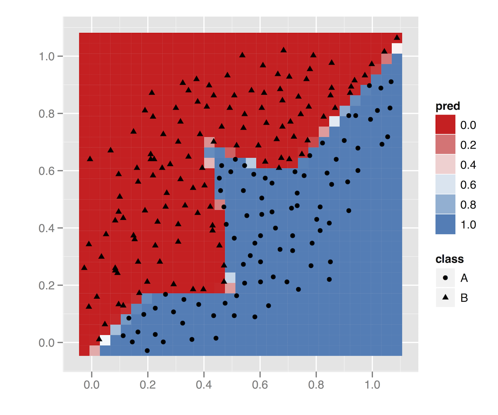
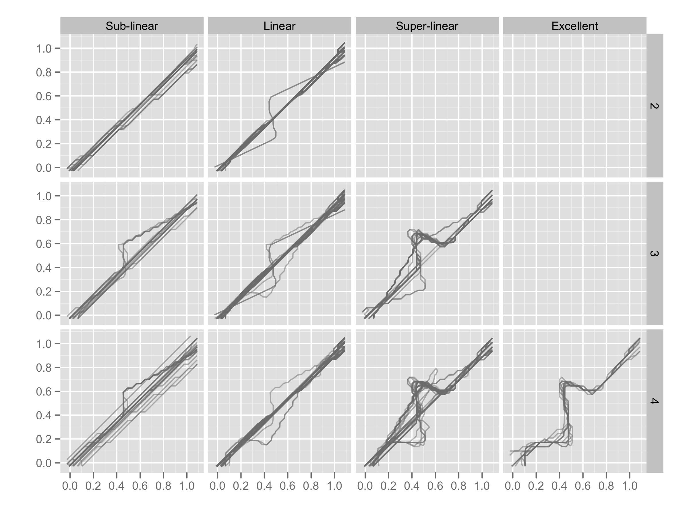
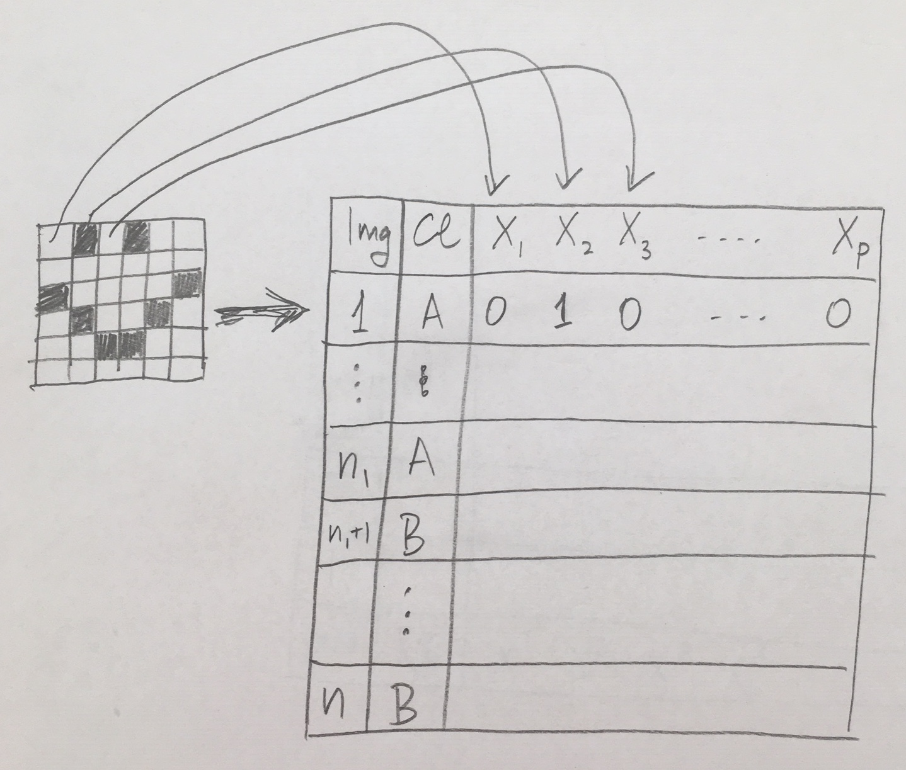
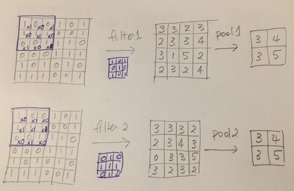
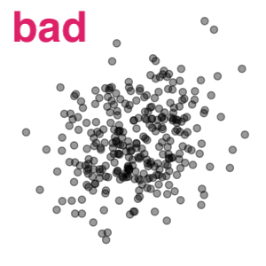
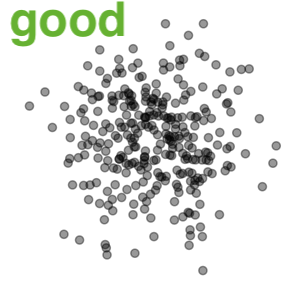
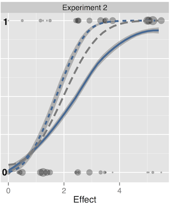
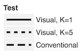
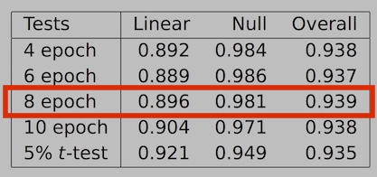
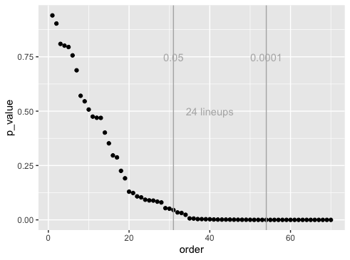

```{r initial, echo = FALSE, cache = FALSE, warning = FALSE, message = FALSE, error=FALSE, results = 'hide'}
library(knitr)
options(htmltools.dir.version = FALSE, tibble.width = 60)
opts_chunk$set(
  message = FALSE, 
  warning = FALSE, 
  error = FALSE, 
  echo = FALSE,
  fig.retina = 3
)
library(tidyverse)
library(kableExtra)
```

```{r xaringan-themer, include=FALSE}
#library(xaringanthemer)
#solarized_light(
#  text_font_family = list(google_font("Lato")),
#)
library(tidyverse)
```

class: inverse middle
background-image: url(images/redgum.jpg)
background-position: 110% 50%
background-size: 50%

# Human vs computer

## .pink[*In Visualising Data, <br> Who Wins?*]

<br>
<br>
### .lightgreen[Professor Di Cook <br> Monash University]


<br>
.green[Irish Statistical Association Gosset Lecture <br> Feb 2021]


---
class: inverse middle
background-image: url(images/redgum.jpg)
background-position: 110% 0%
background-size: 50%

### `r anicon::faa("link", animate = "bounce", anitype = "hover")` You can find the slides at <br> [https://bit.ly/cook-gosset]([https://bit.ly/cook-gosset)

`r anicon::faa("question", animate = "bounce", anitype = "hover")` .green[I welcome any questions: either type]  <br> .green[into the] chat or unmute .green[yourself and talk.] 

---
class: inverse middle
# Firstly, your input

`r anicon::faa("hand-paper", size=1.5, speed ="slow", color="#FD4D6A", anitype="hover")` `r anicon::nia("Using the raise your hand tool, if you fitted a model in the last week", size=1.5, speed ="slow", color="#959B4C", anitype="hover")`

--

 `r anicon::nia("Now, put your hand down if you looked at residual plots from the more.", size=1.5, speed ="slow", color="#959B4C", anitype="hover")`

--

---
background-image: url(images/cartoon.png)
background-size: contain

---

background-image: url(images/housekeeping.png)
background-size: contain

---

background-image: url(images/robot.png)
background-size: contain

---

# Outline

- Motivation: inspiration for these experiments
- Methods
    - Deep learning: image recognition
    - Visual inference: process and framework
- Experiments
    - Design
    - Results
- Future
- Acknowledgements, resources and references

```{r eval=FALSE}
df <- tibble(fitted = runif(500), resid = rnorm(500))
ggplot(df, aes(x=fitted, y=resid)) + 
  geom_point() +
  xlab("Fitted values") +
  ylab("Residuals")
```

---
background-image: url(images/simchoni.png)
background-size: 80%

# True motivation is Giora's blog post


---
.left-code[
Trained a computer vision two ways:

- classification, significant correlation vs not
- regression, to predict the correlation

.green[Success, picked plot 16]
]
.right-plot[

]
---
.left-code[
Trained a computer vision two ways:

- classification, significant correlation vs not
- regression, to predict the correlation

.green[Success, failed to pick plot 4]
]
.right-plot[

]
---
.left-code[
Trained a computer vision two ways:

- classification, significant correlation vs not
- regression, to predict the correlation

.pink[Fail! Doesn't see the strong nonlinear association. Picks the most linear.]
]
.right-plot[

]

---
background-image: url(images/simchoni2.png)
background-size: contain

[Giora Simchoni's JSM 2019 talk](http://giorasimchoni.com/deep_visual_inference.html#/1)

---
# Deep learning

These are images you might see when trying to learn about them. 

.left-code[


.footnote[Source: [Abdellatif Abdelfattah](https://medium.com/@tifa2up/image-classification-using-deep-neural-networks-a-beginner-friendly-approach-using-tensorflow-94b0a090ccd4)]
]
.right-plot[


.footnote[Source: [Chihuahua or Muffin? Brad Folkens](https://blog.cloudsight.ai/chihuahua-or-muffin-1bdf02ec1680)]

]

---
.left-column[
# Deep learning

### Neural network
]
.right-column[
Here's how I think about deep learning models, as extensions to neural networks.


.footnote[Source: [Cheng and Titterington (1994)](https://projecteuclid.org/euclid.ss/1177010638)]
]

---
.left-column[
# Deep learning

### Neural network
]
.right-column[
A simple neural network, contains a hidden layer, to increase/decrease dimensionality, and a transformation through a (logistic) function:


]

---
.left-column[
# Deep learning

### Neural network
]
.right-column[




.footnote[Example from [Wickham et al (2015) "Removing the blindfold"](https://onlinelibrary.wiley.com/doi/abs/10.1002/sam.11271)]

]
---

.left-column[
# Fitting neural networks is difficult


.footnote[Example from [Wickham et al (2015) "Removing the blindfold"](https://onlinelibrary.wiley.com/doi/abs/10.1002/sam.11271)]

]
.right-plot[



]

---
.left-column[
# Deep learning

### Neural network
### Convolutional NN
]
.right-plot[

Thinking about images as data, requires unpacking into variables:


]

---
.left-column[
# Deep learning

### Neural network
### Convolutional NN
]
.right-column[

- Proximity in an image matters though. 
- The dimension reduction takes into account of neighbouring cells in the image, using filters


]

---
.left-column[
# Deep learning

### Neural network
### Convolutional NN
]
.right-column[

Applying multiple filters



]

---
.left-column[
# Deep learning

### Neural network
### Convolutional NN
### Software
]
.right-column[

The [keras](https://keras.rstudio.com) package in R, interfaces to python software, provides a convenient way to fit the convolutional neural network. 


]

---
class: center
background-image: url(images/robot.png)
background-size: 100%

## Training the robot

---
# Model set up overview

- Formulate the problem as a classification task: "good" vs "bad" residual plot. (Call "bad" the real data plot because this is what we want to detect.)
- Simulate an enormous number of both types of residual plots
- Train the model on half of these
- Choose the best model by accuracy with the other half

 

.footnote[beta=0.7, sigma=12, n=300]
---

background-image: url(images/shuofan.png)
background-size: 100%


---
class: center middle
background-image: url(images/housekeeping.png)
background-size: 150%

## How the human evaluated the residual plots

---
.left-column[
# Human evaluation
### Lineup protocol
]
.right-column[
- Statistical inference with graphics, follows classical hypothesis testing procedures
- Lineup protocol embeds the data plot among a field of null plots (comparison of test statistic with sampling distribution)
- Human observers pick plot that is most different from the others
- $p$-value calculated from the probability that the data plot is selected by chance

[Buja et al (2009)](http://rsta.royalsocietypublishing.org/content/367/1906/4361) ideas, [Majumder et al (2013)](https://www.tandfonline.com/doi/abs/10.1080/01621459.2013.808157) validation

]

---

background-image: url(images/inference_diagram.png)
background-size: contain

.footnote[[Majumder et al (2013)](https://www.tandfonline.com/doi/abs/10.1080/01621459.2013.808157)]
---
.left-column[
# Human evaluation
### Lineup protocol
### Database
]
.right-column[

- [Majumder et al (2013)](https://www.tandfonline.com/doi/abs/10.1080/01621459.2013.808157) conducted validation study to compare the performance of the lineup protocol, assessed by human evaluators, in comparison to the classical test
- Experiment 2 examined $H_o: \beta_k = 0 ~~vs ~~H_a: \beta_k \neq 0$
- 70 lineups of size 20 plots: $n=100, 300; \beta \in [-6, 4.5]; \sigma=5, 12$
- 351 evaluations by human subjects
- Amazon's Mechanical Turk used to recruit observers

]

---

.left-column[
# Human evaluation
### Lineup protocol
### Database
### Try it: type your choice into the chat
]
.right-column[


<br>
<br>
<br>
<br>

*From the field of 20 plots shown, pick the plot with the strongest linear relationship between the two variables.*
]

---

background-image: url(images/plot_turk2_300_150_5_3.png)
background-size: contain

---
class: inverse middle

*If you chose 19 you picked the data plot.*

In the Turk study 76/78 observers chose plot 19. The estimated p-value is 0. It is very unlikely to see this result if the data plot was a sample a population with no relationahip between the variables. 


---

background-image: url(images/plot_turk2_300_10_5_3.png)
background-size: contain

```{r eval=FALSE}
turk <- read_csv("data/data_turk2.csv")
turk %>% filter(pic_name == "plot_turk2_300_150_5_3.png") %>%
  count(response)
library(nullabor)
pvisual(76, 78)
turk %>% filter(pic_name == "plot_turk2_300_10_5_3.png") %>%
  count(response)
turk %>% filter(pic_name == "plot_turk2_300_10_5_3.png") %>%
  count(response_no)
pval <- read_csv("data/pvalue_turk2.csv")
pval %>% filter(pic_name == "plot_turk2_300_10_5_3.png") 
```

---
class: inverse middle


*If you chose 18 you picked the data plot.*

In the Turk study 0/19 observers chose plot 18. The estimated p-value is 1. It is very likely to see this result if the data plot was a sample a population with no relationahip between the variables. 

11/19 chose plot number 19. This plot is the plot in the field that has the smallest p-value. People do tend to pick the plot that has the smallest p-value (or the most structure). 


---

.left-column[
# Validation study

$n=100, 300$
$|\beta| \in [0, 16]$ 
$\sigma = 5, 12$

It works!

.footnote[Source: [Majumder et al (2013)](https://www.tandfonline.com/doi/abs/10.1080/01621459.2013.808157)]

]
.right-plot[

Effect $= \frac{\sqrt{n}\times |\beta|}{\sigma}$





]

---

.left-column[
# Human vs computer
### Comparison
]
.right-plot[

$H_o: \beta_k = 0 ~~vs ~~H_a: \beta_k \neq 0$

Linear vs no relationship (null)

]

---
.left-column[
# Human vs computer
### Comparison
### Computer model
]
.pull-right[

Simulation 

$$Y_i = \beta_0 + \beta_1 X_{i}  + \varepsilon_i, ~~i=1, \dots , n$$

- $X \sim N[0,\ 1]$
- $\beta_0 = 0$ (intercept)
- $\beta_1\sim U[-10, -0.1] \bigcup [0.1, 10]$  (linear, null when $\beta_1=0$)
- $\varepsilon\sim N(0, \sigma^2) \ where\ \sigma \sim U[1,12]$ 
- $n=U[50,500]$  
- 200,000 from each linear and null scenario generated



]

---
.left-column[
# Human vs computer
### Comparison
### Computer model
### Testing
]
.pull-right[

### Computer model prediction

- Re-generate the 70 *data plots* using the same data in Turk study (without null plots)
- Use the computer model to predict whether the 70 data plots were "linear" or "null"
- The computer model's predicted accuracy over the 70 data plots are recorded as the model's performance.
]

---
.left-column[
# Human vs computer
### Comparison
### Computer model
### Testing
]
.pull-right[

### Human subjects results

- Calculate $p$-value associated with each lineup using the binomial formula (from Majumder), with $N$=number of evaluations and k=number of people choosing data plot
- Draw conclusion: reject the null when the calculated $p$-value is smaller than $\alpha$.
- The accuracy of the conclusions over the 70 lineups 
]
---
class: inverse middle center

`r anicon::faa("hourglass", animate="tada", speed="slow", color="#FD4D6A", size=2)` 

### Stay tuned for the result!
--

## Experiment repeated

---
# Repeat of experiment

Using same sample of $n$, $\beta$, $\sigma$, new data generated, and images created numerically by binning (to 30x30 pixels), counting and scaling counts to 0-255.

Keras model fitted with 60,000 training images for each class, linear and not.

Accuracy with simulated test data, 93%. Null error 0.0179, linear error 0.1176

.footnote[Code available in the file `keras_correlation.r`]
--

.pink[Its blindingly fast!]

---

background-image: url(images/drumroll.gif)
background-size: 100%

---


# Results (Shuofan)

<table>
<tr> <td> Rank </td> <td> Test type </td> <td> Number correct</td> <td> Proportion </td> </tr>
<tr> <td> 1 </td> <td> Human </td> <td> 47/70 </td> <td> 0.67 </td> </tr>
<tr> <td> 2 </td> <td> t-test </td> <td> 43/70 </td> <td> 0.61 </td> </tr>
<tr> <td> 3 </td> <td> computer </td> <td> 39/70 </td> <td> 0.55 </td> </tr>
</table>

.pink[Humans beat computers.] 


---


# Results (re-do)

Humans beat computers, and match the power of the theoretical t-test (uniformly most powerful test). Computer tends to predict too many as not linear: more are predicted as no structure.

.left-code[


.footnote[Power curves, as in Majumder.]
]
.right-plot[

<table>
<tr> <th> </th> <th> </th> <th colspan="2"> Computer </th> </tr>
<tr> <th> </th> <th>  </th> <th> Not </th> <th> Linear </th> </th> </tr>
<tr> <th rowspan="2"> Human </th> <th> Not </th> <td> 27 </td> <td> 0 </td> </tr>
<tr>  <th> Linear </th> <td> 15 </td> <td> 28 </td> </tr>
</table>
]


---

# Summary

- Computer model trained specifically on detecting linear vs no relationship, comes close but does not beat human evaluation
- Results are consistent: images vs binned data, image size, number of training samples


---
# Things to work on `r icon::fa_rocket()`

- The lineup protocol, from visual inference, provides a way to check and validate the models
    - Need to build up more human subject evaluations
- Model checking may be systematic enough to automate. 
    - Computer only needs to relieve us of most of the work, after all.
- Expand the computer model with simulations of all sorts of departures from no relationship
- Web service for uploading plots

---

background-image: url(images/Rosie.png)
background-size: contain

---

class: inverse 

# Joint work!

- Deep learning model, human vs computer comparison: Monash Masters thesis by Shuofan Zhang (inspired by a blog post by [Giora Simchoni](http://giorasimchoni.com/2018/02/07/2018-02-07-book-em-danno/))
- Inference: Heike Hofmann, Mahbub Majumder, Andreas Buja, Hadley Wickham, Eric Hare, Susan Vanderplas, Adam Loy, Niladri Roy Chowdhury, Nat Tomasetti.

Contact: [`r icon::fa_envelope()`](http://www.dicook.org) dicook@monash.edu [`r icon::fa_twitter()`](https://twitter.com/visnut) visnut [`r icon::fa_github()`](https://github.com/dicook) dicook

.footnote[Slides made with Rmarkdown, xaringan package by Yihui Xie, modified xaringanthemer by Garrick Aden-Buie, and the anicon package by Emi Tanaka, with icon package by Mitch O'Hara-Wild. Available at [https://github.com/dicook/DSSV19](https://github.com/dicook/files/DSSV19).]

---
# Further reading

- Buja et al (2009) Statistical Inference for Exploratory Data Analysis and Model Diagnostics, Roy. Soc. Ph. Tr., A
- Majumder et al (2013) Validation of Visual Statistical Inference, Applied to Linear Models, JASA
- Wickham et al (2010) Graphical Inference for Infovis, InfoVis, Best paper
- Hofmann et al (2012) Graphical Tests for Power Comparison of Competing Design, InfoVis
- Loy et al (2017) Model Choice and Diagnostics for Linear Mixed-Effects Models Using Statistics on Street Corners, JCGS
- Vanderplas et al (2020) Statistical Significance Calculations for Scenarios in Visual Inference, Stat
  
---
# Potential discussion points

- What do you think might be good data visualisation problems for computers to help us on?
- Do you think that human reading of plots is subjective? 
- A recent [twitter thread](https://twitter.com/FrankElavsky/status/1351311898428362754?s=20) castigates the effort placed on addressing colour blindness in plots, and suggests that many other visual problems are more wide-spread. What are your thoughts on this?

.footnote[Is subjective the right word? (Maybe variable or consistency would be better)]

---
class: middle center

<a rel="license" href="http://creativecommons.org/licenses/by-sa/4.0/"></a><br />This work is licensed under a <a rel="license" href="http://creativecommons.org/licenses/by-sa/4.0/">Creative Commons Attribution-ShareAlike 4.0 International License</a>.


